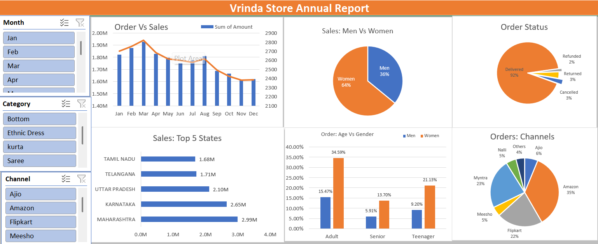

# Vrinda Store Sales Analysis 2022 📊

## Project Objective
The goal of this project is to analyze the sales data of Vrinda Store for the year 2022 to understand customer behavior, identify top-performing regions, and provide insights for business growth.

## Key Insights:
- **Top Customers:** Women account for ~64% of total sales.
- **Top State:** Maharashtra contributes the highest revenue.
- **Top Channel:** Amazon is the most effective sales channel.
- **Target Age Group:** Adults (30-49 years) are the most profitable segment.

## Tools Used:
- Microsoft Excel (Data Cleaning, Pivot Tables, Dashboards).

## Dashboard Preview:

